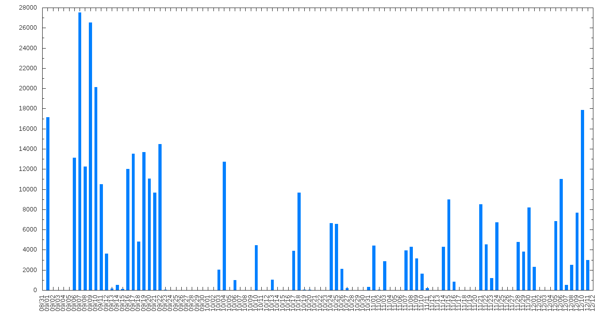

abacus
======

**abacus** is a simple Linux program that sits in the background and counts every key that you press. It is not a keylogger! No information about the keys is stored, only their count.

The daemon itself only counts keypresses and saves the counter to a SQLite3 database. A Python script (included) can then be used to generate a chart through gnuplot.

Example:

abacus was a nice hack but I no longer maintain or use it. It might be completely broken now. You have been warned.

Installation & Usage
--------------------

The program is compiled and installed by the standard `make && sudo make install`.
If your are on a Debian-like distro, a System&nbsp;V-style script will be created in `/etc/init.d` and proper
links added to `/etc/rc.X`.

Charts are generated by a Python script in `charts/abacus-gen-chart.py`.
You can either run it without arguments, or supply a starting and ending date. See the source code for details.

Requirements
------------

* 2.5 &le; Python &lt; 3.0
* Gnuplot
* `evdev` driver